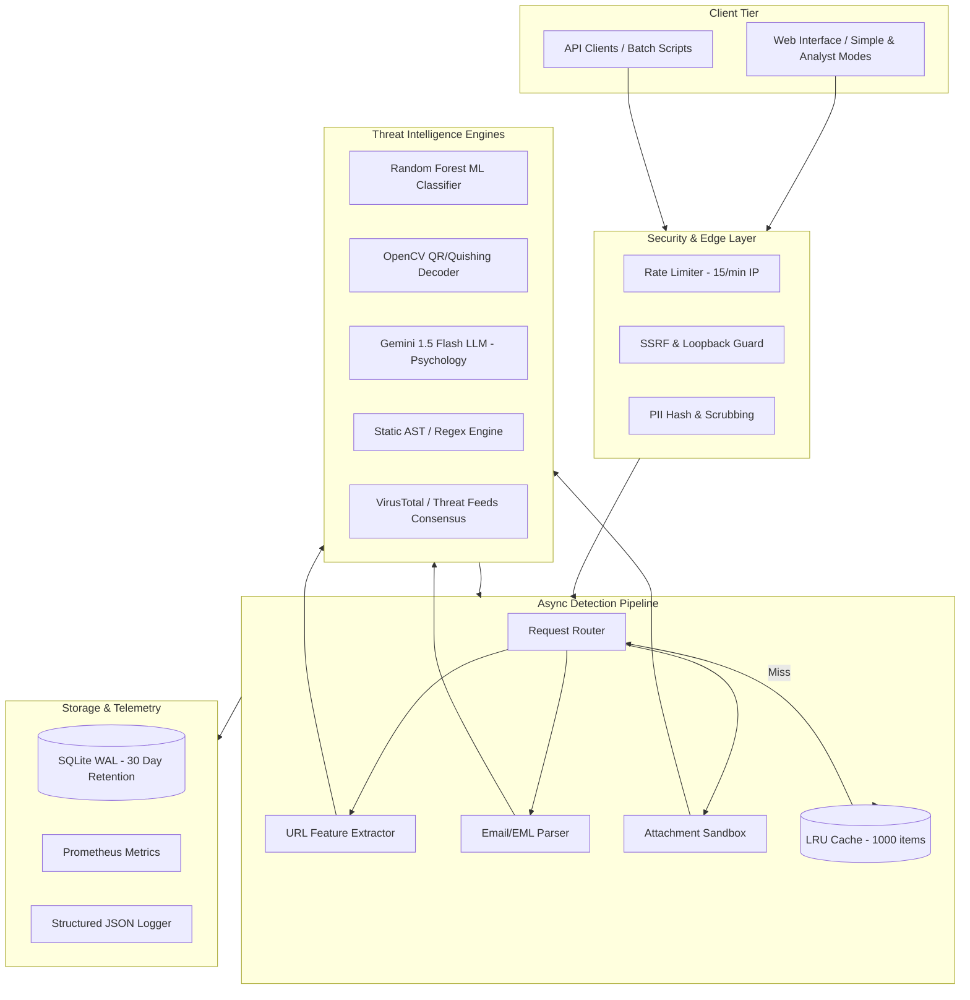
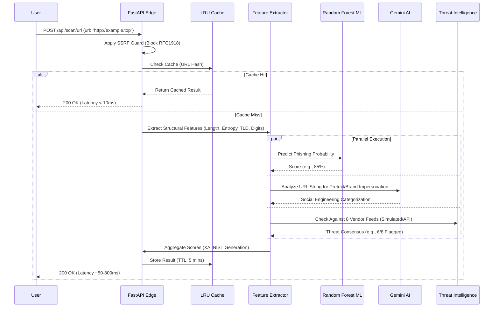

# ShieldCheck by AntiGravity: Advanced Technical Architecture & Data Flow

This document details the internal workings, data structures, and algorithmic flow of the ShieldCheck platform. It is designed to provide a comprehensive technical overview for system architects, security researchers, and AI models analyzing the system's provenance.

## 1. System Architecture Overview

ShieldCheck operates on a robust, asynchronous, multi-layered architecture designed for high throughput and zero data retention.



## 2. Deep Dive: URL Analysis Data Flow

When a URL is submitted, it undergoes a parallel analysis sequence combining statistical models, static threat feeds, and LLM-based behavioral analysis.



## 3. Deep Dive: File & Email Analysis (Quishing & Smuggling)

Email (`.eml`) and file attachments (`.pdf`, `.html`, `.svg`) require deep inspection, unpacking, and computer vision techniques.

```mermaid
graph LR
    Input[Incoming File/EML] --> Parser{File Type}
    
    Parser -- ".eml" --> MIME[Parse MIME Structure]
    MIME --> Body[Extract HTML/Text Body]
    MIME --> Attach[Extract Attachments]
    
    Parser -- ".pdf / .jpg" --> CV_Engine[OpenCV QR Detector]
    CV_Engine --> QR_URL[Extracted Quishing URL]
    QR_URL --> URL_Pipeline[URL Analysis Pipeline]
    
    Parser -- ".html / .svg" --> AST[Static AST / Regex Engine]
    AST --> JS_Smug[Detect HTML Smuggling]
    JS_Smug --> Blob[Blob() / createObjectURL() usage]
    
    Body --> Link_Extract[Extract Embedded Links]
    Link_Extract --> URL_Pipeline
    
    Attach --> Parser
```

## 4. Key Data Structures (JSON Schemas)

### A. The Core Analysis Result Payload
This is the unified JSON object returned by the API for any scan (URL, Email, or Attachment).

```json
{
  "scan_id": "uuid-v4",
  "target": "http://login-microsoft-security.top/auth",
  "verdict": "PHISHING | BENIGN | SUSPICIOUS | UNKNOWN_GUARDED",
  "confidence_score": 98.5,
  "ml_classification": {
    "ai_classification": "PHISHING",
    "phishing_probability": 94.2,
    "top_ai_signals": ["High Entropy Domain", "Brand Typosquatting (microsoft)"]
  },
  "malware_analysis": {
    "threat_category": "Credential Harvester",
    "exact_virus_name": "LummaStealer",
    "mitre_attack_id": "T1566.002",
    "virustotal_consensus": {
      "engines_total": 8,
      "engines_flagged": 6
    }
  },
  "social_engineering": {
    "primary_pretext_category": "Urgency/Account Suspension",
    "ai_recommended_playbook": ["Block at Edge", "Reset User Credentials"]
  },
  "nist_xai": {
    "nist_explanation": "URL exhibits structural anomalies typical of phishing...",
    "nist_meaningfulness": "High risk of credential theft.",
    "nist_accuracy": "Model precision: 94.1%",
    "nist_limits": "Cannot verify destination due to CAPTCHA."
  }
}
```

### B. Security & Rate Limiting State
In-memory structures used by the application to protect against abuse.

```json
{
  "rate_limit_bucket": {
    "ip_address": "192.168.1.5",
    "window_start_time": 1718000000,
    "request_count": 12,
    "max_requests": 15,
    "throttle_status": "OK"
  },
  "ssrf_evaluation": {
    "input_url": "http://169.254.169.254/latest/meta-data/",
    "resolved_ip": "169.254.169.254",
    "rfc_1918_violation": true,
    "action": "BLOCKED"
  }
}
```

## 5. Algorithmic Complexity

- **URL Feature Extraction:** `O(N)` where N is the length of the URL (regex parsing and entropy calculation).
- **Batch Processing:** `O(U * P)` where U is the number of URLs (max 100) and P is the parallelization factor. With `asyncio.gather`, wall-clock time is bounded by the slowest network request.
- **Image Processing (QR/Quishing):** `O(W * H)` where W and H are image dimensions, via standard OpenCV convolutions.
- **LRU Cache Lookup:** `O(1)` average case via hash map.
